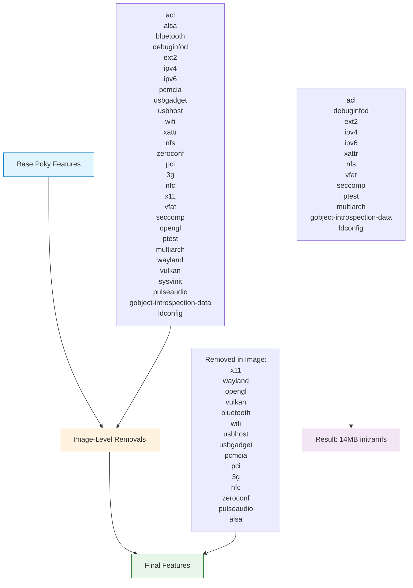

# Poky Distro Features Flow

The diagram below shows how the final DISTRO_FEATURES for `core-image-tiny-initramfs-srk-3` are derived:

Steps:

1. Start from Poky base + Poky default extras.
2. Apply image-level removals in the image recipe (intended list below).
3. Observe the final effective feature set used to build the 14MB initramfs.

Notes:

- The image-level `DISTRO_FEATURES:remove` was originally specified but due to later edits it was removed; this diagram reflects the intended removal list.
- Features like `ptest`, `multiarch`, `gobject-introspection-data`, `ldconfig` persist because they are injected by Poky defaults/backfill unless explicitly suppressed.
