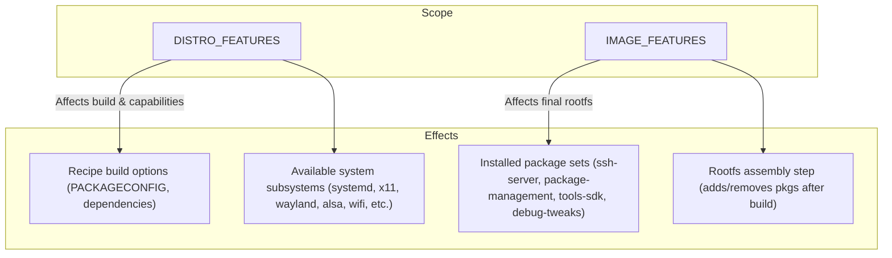

```mermaid
flowchart TD
    A["DISTRO_FEATURES"] -->|Affects build & capabilities| B["Recipe build options (PACKAGECONFIG, dependencies)"]
    A --> C["Available system subsystems (systemd, x11, wayland, alsa, wifi, etc.)"]

    D["IMAGE_FEATURES"] -->|Affects final rootfs| E["Installed package sets (ssh-server, package-management, tools-sdk, debug-tweaks)"]
    D --> F["Rootfs assembly step (adds/removes pkgs after build)"]

    subgraph Scope
        A
        D
    end

    subgraph Effects
        B
        C
        E
        F
    end

    %% Color definitions (Material Design inspired)
    class A,C fill:#388E3C,stroke:#2E7D32,color:white
    class D,E,F fill:#2196F3,stroke:#0D47A1,color:white
```
