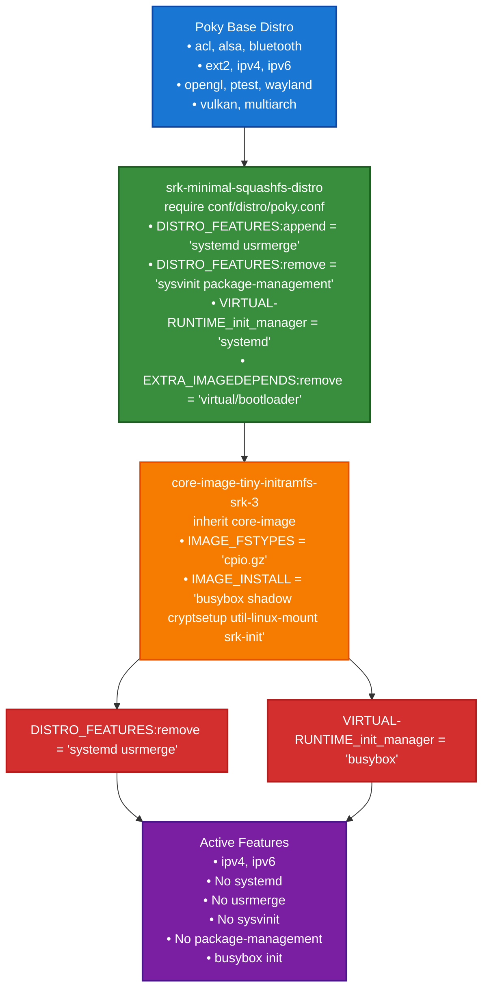

# Yocto Image Distro Inheritance Diagram

```mermaid
graph TD
    %% Material Theme Colors
    classDef pokyClass fill:#1976d2,stroke:#0d47a1,stroke-width:2px,color:#ffffff
    classDef distroClass fill:#388e3c,stroke:#1b5e20,stroke-width:2px,color:#ffffff
    classDef imageClass fill:#f57c00,stroke:#e65100,stroke-width:2px,color:#ffffff
    classDef featureClass fill:#7b1fa2,stroke:#4a148c,stroke-width:2px,color:#ffffff
    classDef overrideClass fill:#d32f2f,stroke:#b71c1c,stroke-width:2px,color:#ffffff

    %% Base Distro
    Poky["Poky Base Distro<br/>• acl, alsa, bluetooth<br/>• ext2, ipv4, ipv6<br/>• opengl, ptest, wayland<br/>• vulkan, multiarch"] --> SRK_Distro

    %% SRK Distro
    SRK_Distro["srk-minimal-squashfs-distro<br/>require conf/distro/poky.conf<br/>• DISTRO_FEATURES:append = 'systemd usrmerge'<br/>• DISTRO_FEATURES:remove = 'sysvinit package-management'<br/>• VIRTUAL-RUNTIME_init_manager = 'systemd'<br/>• EXTRA_IMAGEDEPENDS:remove = 'virtual/bootloader'"] --> Image

    %% Image Recipe
    Image["core-image-tiny-initramfs-srk-3<br/>inherit core-image<br/>• IMAGE_FSTYPES = 'cpio.gz'<br/>• IMAGE_INSTALL = 'busybox shadow cryptsetup util-linux-mount srk-init'"]

    %% Image Overrides
    Image --> Override1["DISTRO_FEATURES:remove = 'systemd usrmerge'"]
    Image --> Override2["VIRTUAL-RUNTIME_init_manager = 'busybox'"]

    %% Features
    Features["Active Features<br/>• ipv4, ipv6<br/>• No systemd<br/>• No usrmerge<br/>• No sysvinit<br/>• No package-management<br/>• busybox init"]

    Override1 --> Features
    Override2 --> Features

    %% Styling
    class Poky pokyClass
    class SRK_Distro distroClass
    class Image imageClass
    class Override1,Override2 overrideClass
    class Features featureClass
```
