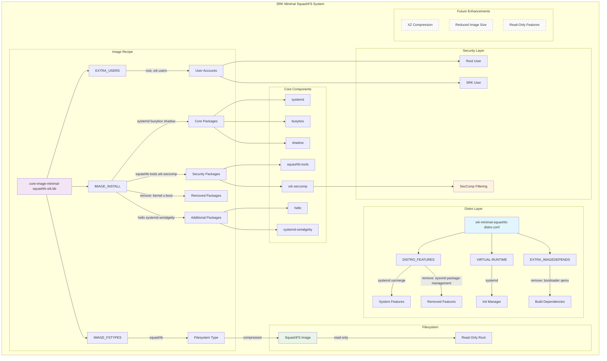

# Core Image Minimal SquashFS SRK

A minimal, systemd-based squashfs image for embedded systems with optimized compression and security features.

## Overview

The `core-image-minimal-squashfs-srk` is a lightweight, compressed filesystem image designed for embedded devices that require:

- **Minimal footprint**: Only essential packages included
- **Systemd init system**: Modern service management
- **SquashFS compression**: Space-efficient read-only filesystem
- **Security features**: Custom user accounts and seccomp support
- **Bootloader-free**: Focused on rootfs without kernel/bootloader artifacts

## Image Components



## Architecture

### Distro Configuration (`srk-minimal-squashfs-distro.conf`)

- **Purpose**: System-wide feature configuration
- **Features**:
  - Enables systemd, usrmerge
  - Removes sysvinit, package-management
  - Sets systemd as init manager
  - Removes bootloader dependencies

### Image Recipe (`core-image-minimal-squashfs-srk.bb`)

- **Purpose**: Package selection and image-specific settings
- **Packages**:
  - **Core**: systemd, busybox, shadow
  - **Tools**: squashfs-tools, hello
  - **Security**: srk-seccomp
  - **Services**: systemd-serialgetty

## Package Details

| Component | Purpose | Size Impact |
|-----------|---------|-------------|
| `systemd` | Modern init system and service manager | Medium |
| `busybox` | Essential Unix utilities in single binary | Small |
| `shadow` | User account management utilities | Small |
| `squashfs-tools` | Tools for creating/managing squashfs | Small |
| `srk-seccomp` | Security filtering for system calls | Minimal |
| `hello` | Custom application package | Minimal |
| `systemd-serialgetty` | Serial console support | Minimal |

## Security Features

### User Accounts

- **Root User**: Full system access with hashed password
- **SRK User**: Limited user account for applications
- **Password Hashing**: MD5 crypt format for compatibility

### SecComp Integration

- System call filtering via `srk-seccomp`
- Restricts dangerous system calls
- Enhances security for embedded applications

## Build Instructions

### Prerequisites

```bash
# Ensure meta-srk layer is added
bitbake-layers add-layer ../meta-srk
bitbake-layers show-layers
```

### Building the Image

```bash
# Set the distro (if not set in image recipe)
echo 'DISTRO = "srk-minimal-squashfs-distro"' >> conf/local.conf

# Build the image
bitbake core-image-minimal-squashfs-srk
```

### Output Location

```bash
# Image will be created at:
tmp/deploy/images/${MACHINE}/core-image-minimal-squashfs-srk-${MACHINE}.squashfs
```

## Configuration Options

### Current Settings

- **Filesystem Type**: SquashFS
- **Init System**: systemd
- **Image Size**: 8192 KB
- **Features**: Minimal (no package management)

### Future Enhancements (TODO)

- **Compression**: XZ compression with 1MB blocks
- **Size Optimization**: Reduced to 6144 KB
- **Read-Only**: Enhanced read-only filesystem features

## Testing

### Boot Testing

```bash
# Mount the squashfs image (for testing)
sudo mkdir -p /mnt/test-squashfs
sudo mount -o loop core-image-minimal-squashfs-srk-${MACHINE}.squashfs /mnt/test-squashfs

# Verify contents
ls -la /mnt/test-squashfs/
```

### User Account Verification

```bash
# Check user accounts in the image
sudo chroot /mnt/test-squashfs /bin/bash
cat /etc/passwd | grep -E "(root|srk)"
```

## Troubleshooting

### Common Issues

1. **Build Failures**: Ensure all dependencies are available
2. **Size Issues**: Check `IMAGE_ROOTFS_SIZE` if image is too large
3. **Boot Issues**: Verify systemd configuration and services

### Debug Commands

```bash
# Show image contents
bitbake -e core-image-minimal-squashfs-srk | grep ^IMAGE_INSTALL=

# Show distro features
bitbake -e core-image-minimal-squashfs-srk | grep ^DISTRO_FEATURES=

# Generate dependency graph
bitbake -g core-image-minimal-squashfs-srk
```

## Related Files

- **Distro Config**: `conf/distro/srk-minimal-squashfs-distro.conf`
- **Image Recipe**: `recipes-srk/images/core-image-minimal-squashfs-srk.bb`
- **Security Component**: `recipes-srk/srk-seccomp/srk-seccomp.bb`
- **Hello Package**: `recipes-srk/hello/hello_1.0.bb`

## License

MIT License - See COPYING.MIT for details.
