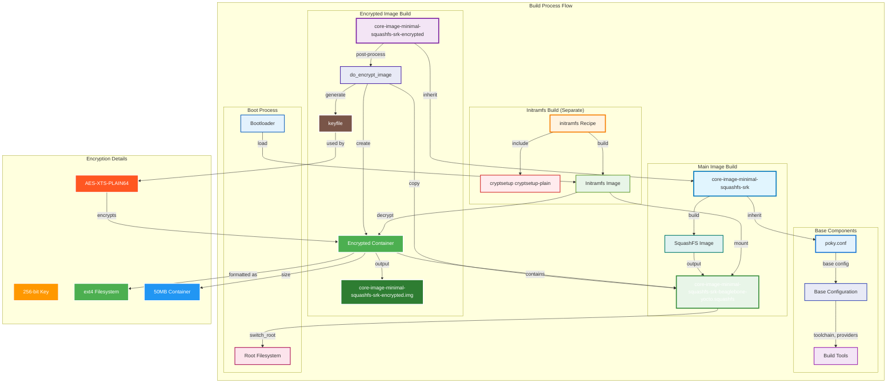

# Core Image Minimal SquashFS SRK Encrypted

This recipe creates an encrypted container containing the SquashFS image from `core-image-minimal-squashfs-srk`.

## Architecture Overview



## Key Features

- **Base Image**: Inherits from `core-image-minimal-squashfs-srk`
- **Encryption**: Creates AES-XTS encrypted container using cryptsetup
- **Post-Processing**: Runs after main image build completes
- **Optional**: Can be enabled/disabled via configuration
- **Post-Processing**: Runs after main image build completes
- **Optional**: Can be enabled/disabled via configuration

## Usage

### Enable Encryption

Add to your `local.conf`:

```bash
# Enable encrypted image creation
ENCRYPT_IMAGE = "1"

# Optional: Set custom container size (default: 50MB)
ENCRYPTED_CONTAINER_SIZE = "100"
```

### Build the Encrypted Image

```bash
bitbake core-image-minimal-squashfs-srk-encrypted
```

## Output

The build will create:

1. **Encrypted Container**: `core-image-minimal-squashfs-srk-encrypted-beaglebone-yocto-encrypted.img`
2. **Keyfile**: `keyfile` in the build directory (if not exists)
3. **Original SquashFS**: `core-image-minimal-squashfs-srk-beaglebone-yocto.squashfs`

## Encryption Details

- **Cipher**: AES-XTS-PLAIN64
- **Key Size**: 256 bits
- **Container Size**: 50MB (configurable)
- **Filesystem**: ext4 inside encrypted container

## Security Notes

- **Keyfile**: Automatically generated if not present
- **Permissions**: Keyfile has 600 permissions
- **Storage**: Keep keyfile secure for decryption

## Dependencies

- `cryptsetup-native` for host tools
- Base image: `core-image-minimal-squashfs-srk`

## Integration with Initramfs

This recipe creates the encrypted container. The initramfs (built separately) should include:

```bitbake
# In your initramfs recipe
IMAGE_INSTALL:append = " cryptsetup cryptsetup-plain"
```

This ensures the initramfs has the necessary tools to decrypt and mount the container during boot.

## Troubleshooting

### Common Issues

1. **Loop device not found**: Ensure you have sufficient loop devices available
2. **Permission denied**: Run build with appropriate privileges
3. **Keyfile missing**: Check `${TOPDIR}/keyfile` exists and has correct permissions

### Debug Commands

```bash
# Check available loop devices
sudo losetup -a

# Verify encrypted container
sudo cryptsetup luksDump /path/to/encrypted.img

# Mount for inspection
sudo losetup -f /path/to/encrypted.img
sudo cryptsetup open /dev/loopX encrypted_container
sudo mount /dev/mapper/encrypted_container /mnt/test
```
